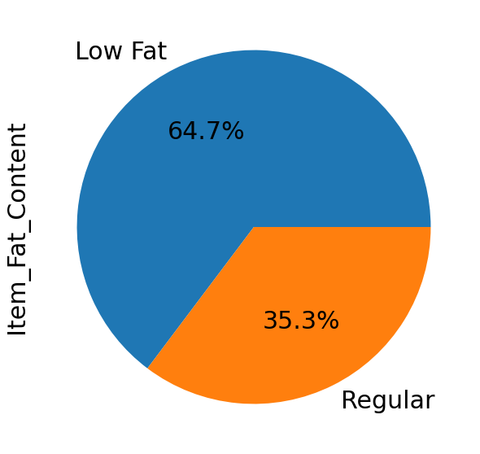
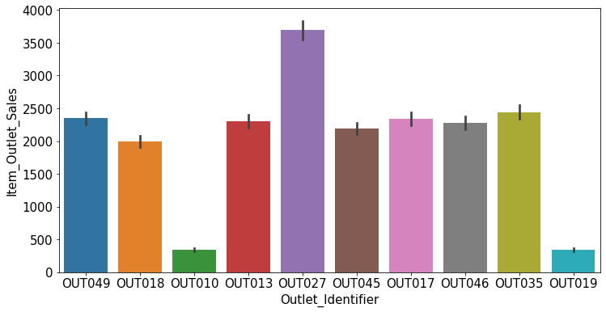

# Predicción de ventas para productos alimenticios vendidos en diversas tiendas.

# Visión general del proyecto.

Predecir con precisión las ventas de productos alimenticios en varias tiendas es una parte esencial de cualquier negocio. Al tener un pronóstico de ventas confiable, las empresas pueden tomar decisiones informadas sobre su inventario y estrategias de marketing. Usando un modelo de predicción, las empresas pueden hacer un pronóstico preciso sobre las ventas futuras de sus productos alimenticios. Esto les permite planificar mejor las próximas promociones y ajustar sus precios en consecuencia. Además, les ayuda a comprender la importancia de lanzar nuevos productos y cómo se desempeñarán en las diferentes tiendas.

Basicamente el problema: los minoristas de alimentos siempre se están quedando sin inventario. Como resultado, los clientes están insatisfechos, lo que se traduce en menores ganancias y mayores costos operativos. La solución: pronosticar las ventas de productos alimenticios específicos, por región y tienda.

# Explicación de los datos.

Item_Identifier /             object  /   Identificación única del producto. 

Item_Weight      /            float64  /   Peso del producto.

Item_Fat_Content  /            object  /   Si el producto es bajo en grasa o regular. 

Item_Visibility    /          float64  /   Porcentaje de la superficie total de exposición de todos los productos de una tienda asignada al producto concreto. 

Item_Type           /          object  /   Categoría a la que el producto pertenece. 

Item_MRP            /         float64  /   Precio máximo de venta al público (precio de catálogo) del producto. 

Outlet_Identifier   /          object  /   Identificación única de la tienda. 

Outlet_Establishment_Year/      int64  /   El año en que se estableció la tienda. 

Outlet_Size         /          object  /   El tamaño de la tienda en cuanto al área total. 

Outlet_Location_Type/          object  /   El tipo de área donde se encuentra la tienda. 

Outlet_Type          /         object  /   Si el punto de venta es una tienda de comestibles o algún tipo de supermercado. 

Item_Outlet_Sales    /        float64  /   Ventas del producto en una tienda particular. Es la variable objetivo a predecir. 

dtype: object

 
RangeIndex: 8523 entries, 0 to 8522 

Data columns (total 13 columns): 

 N   Column          /           Non-Null Count / Dtype   
 
 0   Item_Identifier  /          8523 non-null  / object  

 1   Item_Weight       /         8523 non-null  / float64 

 2   Item_Fat_Content   /        8523 non-null  / object  

 3   Item_Visibility    /        8523 non-null  / float64 

 4   Item_Type          /        8523 non-null  / object 

 5   Item_MRP           /        8523 non-null  / float64 

 6   Outlet_Identifier  /        8523 non-null  / object 

 7   Outlet_Establishment_Year /  8523 non-null /  int64  

 8   Outlet_Size        /        8523 non-null  / object 

 9   Outlet_Location_Type /      8523 non-null  / object 

 10  Outlet_Type          /      8523 non-null  / object 

 11  Item_Outlet_Sales    /      8523 non-null  / float64 

 12  Sold_Units           /      8523 non-null  / float64 

dtypes: float64(5), int64(1), object(7)
  

Grafico pastel que muestra la composicion de productos vendidos contra la categoria 'Item Fat Content' 

Gráfico de barras que representa una estimación de la tendencia central de las ventas de productos por tiendas.

# Resumen de resultados y recomendaciones. 

El objetivo de este proyecto es crear un modelo de predicción que sea capaz de predecir las ventas totales de los diferentes productos alimenticios que se venden en diversas tiendas. Para predecir las ventas de la empresa se nos ha proporcionado el dataset con la recopilación de informaciones vinculadas a las ventas de productos alimenticios de diferentes supermercados. Dentro del mismo, al realizar un cuadro de correlación entre los datos y la columna a predecir se demostró que existe un bajo porcentaje de correlación entre la mayoría de los datos y la columna a predecir, obteniendo así resultados poco fructíferos donde se mostraba un bajo porcentaje de correlación entre varios de los datos, con excepción del item_MRP el cuál si obtuvo un nivel porcentual aceptable. Sin embargo, después de hacer el modelo de predicción, al momento de ponerlo a prueba, se pudo notar que la data tenía ciertas inconsistencias. Dichas inconsistencias fueron evidenciadas cuando se evaluó el modelo con el método del coeficiente de determinación (r^2), no superaban una precisión de 57%. Por esta razón le recomendamos añadir información valiosa que esté directamente relacionada con las ventas de la organización. Tales como el inventario, las unidades vendidas y la demanda del producto, para poder obtener mejores resultados a la hora de predecir las ventas para los productos alimenticios vendidos en diversas tiendas.
